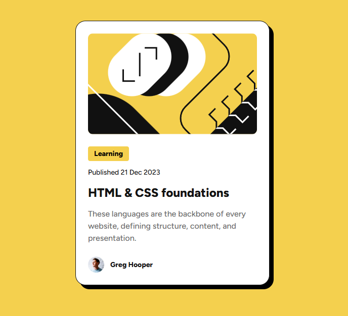
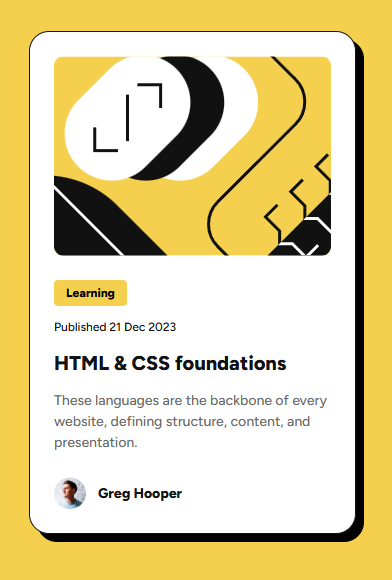

# Frontend Mentor - Blog preview card solution

This is a solution to the [Blog preview card challenge on Frontend Mentor](https://www.frontendmentor.io/challenges/blog-preview-card-ckPaj01IcS). Frontend Mentor challenges help you improve your coding skills by building realistic projects. 

## Table of contents

- [Overview](#overview)
  - [The challenge](#the-challenge)
  - [Screenshot](#screenshot)
  - [Links](#links)
- [My process](#my-process)
  - [Built with](#built-with)
  - [What I learned](#what-i-learned)
  - [Continued development](#continued-development)
  - [Useful resources](#useful-resources)
  - [AI Collaboration](#ai-collaboration)
- [Author](#author)
- [Acknowledgments](#acknowledgments)

## Overview

### The challenge

Users should be able to:

- See hover and focus states for all interactive elements on the page

### Screenshot

### Links

- Solution URL: https://github.com/sanei-i/git-blog-preview-card
- Live Site URL: https://blog-preview-card-sanei-i.netlify.app/
## My process

### Built with

- HTML5
- CSS
- Flexbox
- Responsive design

### What I learned

Through this project, I learned how borders affect layout sizing, how to create flexible layouts without relying too much on fixed widths, how to handle responsive design with media queries, and how to add hover and focus states for interactive elements.

### Continued development

I want to continue improving my responsive design skills and become more comfortable building flexible layouts without relying on fixed sizes.

### AI Collaboration

I used ChatGPT as a learning support tool while building this project, especially for understanding responsive layouts, Flexbox, and interactive states in CSS.

## Author

- GitHub - [sanei-i](https://github.com/sanei-i)
- Frontend Mentor - [sanei-i](https://www.frontendmentor.io/profile/sanei-i)
